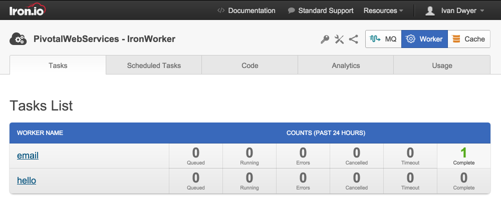
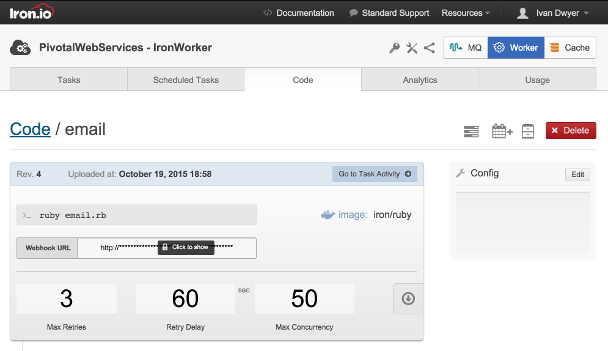
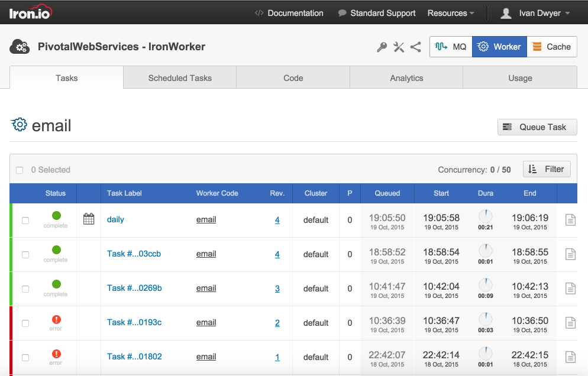
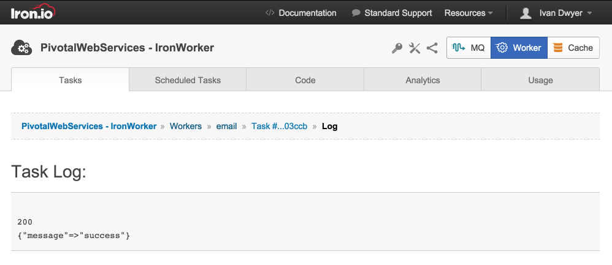

Every cloud native application needs to do work in the background. [IronWorker](http://www.iron.io/worker) gives you a reliable way to run tens, hundreds, or thousands of asynchronous tasks at once. Queue tasks from your app, schedule jobs to run later, or fire off code from webhooks. No need to stand up servers or manage queues. IronWorker scales out the processing to let you focus on building apps at scale.

## Managing Services ##

To create and bind a service instance, see [Managing services from the command line](/devguide/services/managing-services.html).

## Using Service Instances with your Application ##

See [Binding Applications to Service Instances](/devguide/services/application-binding.html#use) and [VCAP_SERVICES Environment Variable](/devguide/deploy-apps/environment-variable.html).

Format of credentials in `VCAP_SERVICES` environment variable:

~~~xml
{
   ironworker: [
      {
         name: "ironworker-test",
         label: "ironworker",
         tags: [ ],
         plan: "small",
         credentials: {
            project_id: "PROJECT_ID",
            token: "TOKEN"
         }
      }
   ]
}
~~~

## Getting Started with IronWorker ##

Tasks within IronWorker are individual microservices packaged as a Docker image. Iron.io offers lightweight Docker images that provide the base language dependencies for Java, Ruby, PHP, Python, .NET, Node.js, or Go.

This quick example is a Ruby task that sends an email using [Sendgrid](http://docs.run.pivotal.io/marketplace/services/sendgrid.html), another Marketplace service add-on. Sending emails are a great example of an asynchronous task as they fall outside the critical path. 

### Installing the CLI ###

You'll need Docker install to interface with IronWorker. The new CLI has a simple installer.

<pre class="terminal">
$ curl -sSL https://cli.iron.io/install | sh
</pre>

### Building the Job ###

IronWorker promotes a Docker-based workflow so that the local environment is the same as the production environment. The following example Ruby file contains the simple task code that takes email addresses as a payload, and then sends an email using Sendgrid. Note that we will vendor the dependencies with our code package, so require the bundler on the first line. 

`email.rb`
~~~xml
require_relative 'bundle/bundler/setup'
require 'json'
require 'sendgrid-ruby'
require 'iron_worker'

sendgrid = SendGrid::Client.new(api_key:'API_KEY')

mail = SendGrid::Mail.new do |m|
    m.to      = IronWorker.payload["to"]
    m.from    = IronWorker.payload["from"]
    m.subject = 'Hi From IronWorker'
    m.text    = "This email was sent via IronWorker"
end

res = sendgrid.send(mail)
puts res.code
puts res.body
~~~

Include a Gemfile for our Ruby dependencies.

`Gemfile`
~~~xml
source 'https://rubygems.org'

gem 'json'
gem 'iron_worker'
gem 'sendgrid-ruby'
~~~

Our simple Dockerfile will use the base Ruby image from Iron.io and set the executable.

`Dockerfile`
~~~xml
FROM iron/ruby

WORKDIR /app
ADD . /app

CMD []
ENTRYPOINT ["ruby", "email.rb"]
~~~

With our task code and dependencies in place, run the following command to build the worker.

<pre class="terminal">
$ docker run --rm -v "$PWD":/worker -w /worker iron/ruby:dev bundle install --standalone --clean
</pre>

Now run the task local via Docker. Choosing the `iron/ruby` base image will ensure the same environment running in production. The task takes in a payload to set the To: and From: fields in the email, so place in a json file to test.

`email.payload.json`
~~~xml
{
    "from": "FROM_EMAIL",
    "to": "TO_EMAIL"
}
~~~

<pre class="terminal">
$ docker run --rm -it -e "PAYLOAD_FILE=email.payload.json" -v "$PWD":/worker -w /worker iron/ruby ruby email.rb
</pre>

### Upload the Code Package ###

With the task built and tested local, it’s time to upload to Iron.io. Task code is securely stored in Iron.io's environment. Iron.io also supports Docker Hub or any private repository. [Contact Us](http://www.iron.io/contact) if you'd like to enable that feature.

<pre class="terminal">
$ zip -r email.zip .
</pre>

<pre class="terminal">
$ iron worker upload --name email --zip email.zip iron/ruby ruby email.rb
</pre>

### Queue a Job ###

Once uploaded, queue up a single job to make sure it runs as intended. The --wait parameter will display the results of the job after it is run on the server.

<pre class="terminal">
$ iron worker queue --payload-file email.payload.json --wait email
</pre>

## Using the Iron.io Dashboard ##

Visit the Iron.io Dashboard by selecting ‘Manage’ next to the IronWorker service in your Pivotal Web Services Dashboard. From here, you can see all of your Tasks, view the overall activity, see each Task log, manage Schedules, and more.

### Managing Tasks ###

All code packages uploaded to Iron.io via CLI appear as Tasks in the Dashboard. This is a real-time view that shows the count of jobs currently queued and running, and those that have errored, were canceled, timed out, and completed in the past 24 hours.

### Configure a Task ###

Each code package can be configured to how the jobs should be executed and triggered. A key feature of IronWorker is the ability to set a webhook as a trigger. Each code package has a unique webhook url that can be associated with any 3rd party service that supports webhooks. When the webhook endpoint is hit, a job is placed in the queue for execution automatically.

Additional configuration items include the ability to set the concurrency levels, which is the maximum number of jobs that can be run in parallel. IronWorker will pull as many jobs from the queue for execution as allowed for a specific job and account. Jobs that fail can also automatically be retried, which you can set as well.

### Schedule a Task ###

To create a regular occurring job from one of your uploaded Tasks, select ‘Scheduled Tasks’, and then select the Calendar icon to add a new schedule. In the window, select the Task Code from the list and set the desired schema. Note that Iron.io offers various priority queues to set the importance of some jobs over others. The queue is a key component to IronWorker as it persists the job throughout its entire lifecycle, and acts as the core dispatcher to the execution runtime.

### View Task Activity ###

The Task view shows all recent activity. This is a real-time view that will show current state for running and completed jobs. The calendar icon indicates a scheduled job. Queue time, start time, duration and end time are lifecycle metrics for the individual job container. 

### Inspect a Job ###

Each job container outputs the process STDOUT for inspection. Additionally, logging and monitoring tools can be integrated with various 3rd party tools or a syslog endpoint. [Contact Us](http://www.iron.io/contact) if you'd like to enable that feature. 

## Using IronWorker with Your Applications ##

Jobs in IronWorker can be triggered for execution directly within your applications. This is useful for things like a billing transaction, where the credit card process happens asynchronously to avoid making the user wait. You can follow our [REST API](http://dev.iron.io/worker/reference/api), or use one of our client libraries in your language of choice. Follow the [Client Configuration](http://dev.iron.io/worker/reference/configuration/) Docs to ensure your credentials are properly setup to interface with the API.

### Client Libraries ###

- [Ruby](https://github.com/iron-io/iron_worker_ruby)
- [PHP](https://github.com/iron-io/iron_worker_php)
- [Python](https://github.com/iron-io/iron_worker_python)
- [Java](https://github.com/iron-io/iron_worker_java)
- [Node.js](https://github.com/iron-io/iron_worker_node)
- [Go](https://github.com/iron-io/iron_go)
- [.NET](https://github.com/iron-io/iron_dotnet)

### Queue from Application ###

Using Ruby as an example, a REST endpoint can trigger a job in IronWorker.

~~~xml
require 'sinatra'
require 'iron_worker'

iron_worker = IronWorker::Client.new

get '/job' do
  task = client.tasks.create('email')
end
~~~xml

This is just the tip of the iceberg. IronWorker has a [robust API](http://dev.iron.io/worker/reference/api/) that allows for a lot more interaction with your workers.

##  Additional Information ##

- [Contact Us](http://www.iron.io/contact/)
- [Dev Center](http://dev.iron.io/worker)
- [Example Repositories](http://dev.iron.io/worker/examples/)
- [System Status](http://status.iron.io/)
- [Iron.io on GitHub](https://github.com/iron-io)
- [Frequently Asked Questions](http://dev.iron.io/faq)
- [Report an Issue](https://github.com/iron-io/issues/issues)
