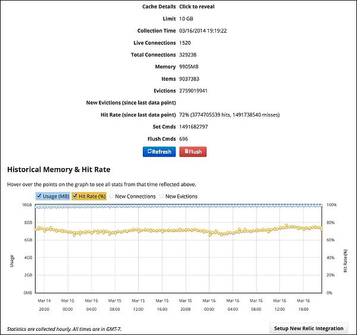

[MemCachier](http://www.memcachier.com/) is an implementation of the [Memcache](http://memcached.org/) in-memory key-value store used for caching data. MemCachier is a key technology for scaling and reducing server loads in web applications. The MemCachier add-on manages and scales clusters of memcache servers so that operators can focus on their applications.

MemCachier will work with any memcached binding that supports [SASL authentication](https://en.wikipedia.org/wiki/Simple_Authentication_and_Security_Layer) and the [binary protocol](https://code.google.com/p/memcached/wiki/MemcacheBinaryProtocol).

MemCachier also supports integration with your New Relic dashboard if you are a customer of both MemCachier and New Relic and if your cache is 500MB or larger. For more information on this integration, refer to [this blog post](http://blog.memcachier.com/2014/03/05/memcachier-and-new-relic-together/).

Tell us how much memory you need and get started for free instantly. You can add capacity later as the need arises.

## Managing Services ##

Refer to the [Managing Service Instances with the CLI](/devguide/services/managing-services.html) topic for more information.

### Creating a MemCachier Service ###

Create a MemCachier service with the following command:

<pre class="terminal">
$ cf create-service memcachier PLAN_NAME INSTANCE_NAME
</pre>

where `PLAN_NAME` is the name of the desired plan and `INSTANCE_NAME` is a name meaningful to you.

### Binding Your MemCachier Service ###

Bind your MemCachier service to your app using the following command:

<pre class="terminal">
$ cf bind-service APP_NAME INSTANCE_NAME
</pre>

Once your MemCachier service is bound to your app, the service credentials will be stored in the `VCAP_SERVICES` environment variable in the following format:

~~~xml
{
  "memcachier": [
    {
      "name":"Memcachier1",
      "label":"memcachier",
      "tags":[ "Data Stores","Data Store","Caching","key-value","caching" ],
      "plan":"dev",
      "credentials":{
        "servers":"mc5.dev.ec2.memcachier.com:11211",
        "username":"username",
        "password":"password"
      }
    }
  ]
}
~~~

For more information, see [Using Service Instances with your Application](/devguide/services/adding-a-service.html#using) and [VCAP_SERVICES Environment Variable](/devguide/deploy-apps/environment-variable.html).

## Using MemCachier with Ruby ##

Start by adding the [Dalli](https://github.com/mperham/dalli) gem to your Gemfile. Dalli is a high performance Ruby memcache client.

<pre>
gem 'dalli'
</pre>

Then run `bundle install`.

Before writing code, you need to create a client object with the correct credentials and settings as the example below shows:

~~~xml
require 'dalli'
credentials = memcachier_servers = memcachier_username = memcachier_password = ''
if !ENV['VCAP_SERVICES'].blank?
  JSON.parse(ENV['VCAP_SERVICES']).each do |k,v|
    if !k.scan("memcachier").blank?
      credentials = v.first.select {|k1,v1| k1 == "credentials"}["credentials"]
      memcachier_servers = credentials["servers"]
      memcachier_username = credentials["username"]
      memcachier_password = credentials["password"]
    end
  end
end
cache = Dalli::Client.new((memcachier_servers || "").split(","),
                    {:username => memcachier_username,
                     :password => memcachier_password,
                     :failover => true,
                     :socket_timeout => 1.5,
                     :socket_failure_delay => 0.2})
~~~

You can now use the cache through operations such as `get` and `set`, as the example shows:

~~~xml
cache.set("foo", "bar")
puts cache.get("foo")
~~~

## Using MemCachier with Rails ##

Rails supports three types of caching: automatic whole site, per-view, and fragment. Refer to the [Rails caching guide](http://guides.rubyonrails.org/caching_with_rails.html) for more information on using MemCachier with Rails.

Add the Dalli gem and run `bundle install` as described in the above <a href="#ruby">Ruby</a> section. Once this gem is installed, configure the Rails `cache_store` appropriately. Modify your `config/environments/production.rb` with the following:

~~~xml
credentials = memcachier_servers = memcachier_username = memcachier_password = ''
if !ENV['VCAP_SERVICES'].blank?
  JSON.parse(ENV['VCAP_SERVICES']).each do |k,v|
    if !k.scan("memcachier").blank?
      credentials = v.first.select {|k1,v1| k1 == "credentials"}["credentials"]
      memcachier_servers = credentials["servers"]
      memcachier_username = credentials["username"]
      memcachier_password = credentials["password"]
    end
  end
end
config.cache_store = :dalli_store,
                    (memcachier_servers || "").split(","),
                    {:username => memcachier_username,
                     :password => memcachier_password,
                     :failover => true,
                     :socket_timeout => 1.5,
                     :socket_failure_delay => 0.2
                    }
~~~

<strong>Note</strong>: Rails.cache defaults to an in-memory store in your deployment environment, so it does not require a running memcached.

### Testing from Rails ###

To test locally you can use the rails console:

<pre class="terminal">
rails console
>> Rails.cache.write('memcachier', 'clouds')
=> true
>> Rails.cache.read('memcachier')
=> 'clouds'
</pre>

## Using MemCachier with Python ##

MemCachier has been tested with the `pylibmc` memcache client. This client relies on the `C libmemcached` library, which you can install with your package manager on Linux or Windows. Once `libmemcached` is installed, install `pylibmc`:

<pre class="terminal">
$ pip install pylibmc
</pre>

Be sure to update your `requirements.txt` file with the new `pylibmc` requirement. Your version might differ from the version in the below example.

<pre>
pylibmc==1.4.0
</pre>

<strong>Note</strong>: If you have difficulty installing the <code>C libmemcached</code> library or <code>pylibmc</code>, you can try <code>python-binary-memcached</code>. This is a pure python client that only supports Python 2 at this time.

Next, configure your `settings.py` file as the following example shows:

~~~xml
memcachier_service = json.loads(os.environ['VCAP_SERVICES'])['memcachier'][0]
credentials = statica_service['credentials']

servers = credentials('servers').split(',')
user = credentials('username')
pass = credentials('password')

mc = pylibmc.Client(servers, binary=True,
                    username=user, password=pass,
                    behaviors={"tcp_nodelay": True,
                               "ketama": True,
                               "no_block": True,})
~~~

After this, you can start writing cache code in your Python application:

<pre>
mc.set("foo", "bar")
print mc.get("foo")
</pre>

<strong>Note</strong>: An error message you might get from <code>pylibmc</code> is <strong>MemcachedError: error 37 from memcached_set: SYSTEM ERROR (Resource temporarily unavailable)</strong>. This indicates that you are trying to store a value larger than 1 MB. MemCachier has a hard limit of 1 MB for the size of key-value pairs. To work around this, either consider sharding the data or using a different technology. The benefit of an in-memory key-value store diminishes at 1 MB and higher.

##Using MemCachier with Node.js ##

For Node.js we recommend the use of the [memjs](http://github.com/alevy/memjs) client library, which is written and supported by MemCachier. To install memjs, use [node package manager (npm)](http://npmjs.org/) as the following command shows:

<pre class="terminal">
$ npm install memjs
</pre>

The memjs library understands the `MEMCACHIER_SERVERS`, `MEMCACHIER_USERNAME`, and `MEMCACHIER_PASSWORD` environment variables that the MemCachier add-on sets up, as the following example shows:

<pre>
var memjs = require('memjs')
var mc = memjs.Client.create()
mc.get('hello', function(val) {
  alert(val)
})
</pre>

##Using MemCachier with Java ##

We recommend using the [SpyMemcached](http://code.google.com/p/spymemcached/) client for Java. We also recommend using the [Apache Maven](http://maven.apache.org/) build manager for working with Java applications. If you are not using `maven` and are isntead using [Apache Ant](http://ant.apache.org/) or your own build system, then add the `spymemcached` jar file as a dependency of your application.

<strong>Note</strong>: Please make sure to use version <strong>2.8.9</strong> of SpyMemcached. Versions 2.8.10 and later currently have an <a href="http://code.google.com/p/spymemcached/issues/detail?id=272">issue</a> with SASL authentication that makes these versions unusable with MemCachier.

If you are using `maven`, start by configuring it to have the proper `spymemcached` repository:

~~~xml
<repository>
  <id>spy</id>
  <name>Spy Repository</name>
  <layout>default</layout>
  <url>http://files.couchbase.com/maven2</url>
  <snapshots>
    <enabled>false</enabled>
  </snapshots>
</repository>
~~~

Then add the `spymemcached` library to your dependencies:

~~~xml
<dependency>
  <groupId>spy</groupId>
  <artifactId>spymemcached</artifactId>
  <version>2.8.9</version>
  <scope>provided</scope>
</dependency>
~~~

Once your build system is configured, you can start adding caching to your Java app as shown in the following example:

~~~xml
import java.io.IOException;
import net.spy.memcached.AddrUtil;
import net.spy.memcached.MemcachedClient;
import net.spy.memcached.ConnectionFactoryBuilder;
import net.spy.memcached.auth.PlainCallbackHandler;
import net.spy.memcached.auth.AuthDescriptor;

public class Foo {
  public static void main(String[] args) {
    String vcap_services = System.getenv("VCAP_SERVICES");
    String memcachier_servers = "";
    String memcachier_username = "";
    String memcachier_password = "";

    if (vcap_services != null && vcap_services.length() > 0) {
        // parsing memcachier credentials
        JsonRootNode root = new JdomParser().parse(vcap_services);
        JsonNode memcachierNode = root.getNode("memcachier");
        JsonNode credentials = memcachierNode.getNode(0).getNode("credentials");
        memcachier_servers = credentials.getStringValue("servers");
        memcachier_username = credentials.getStringValue("username");
        memcachier_password = credentials.getStringValue("password");
    }
    AuthDescriptor ad = new AuthDescriptor(new String[] { "PLAIN" },
        new PlainCallbackHandler(memcachier_username,
            memcachier_password));

    try {
      MemcachedClient mc = new MemcachedClient(
          new ConnectionFactoryBuilder()
              .setProtocol(ConnectionFactoryBuilder.Protocol.BINARY)
              .setAuthDescriptor(ad).build(),
          AddrUtil.getAddresses(memcachier_servers));
      mc.set("foo", "bar");
      System.out.println(mc.get("foo"));
    } catch (IOException ioe) {
      System.err.println("Couldn't create a connection to MemCachier: \nIOException "
              + ioe.getMessage());
    }
  }
}
~~~

You might want to set the above code up as a new MemCachierClient class as shown in the following example:

~~~xml
package com.memcachier.examples.java;

import java.io.IOException;
import java.net.InetSocketAddress;
import java.util.ArrayList;
import java.util.List;

import javax.security.auth.callback.CallbackHandler;

import net.spy.memcached.ConnectionFactory;
import net.spy.memcached.ConnectionFactoryBuilder;
import net.spy.memcached.MemcachedClient;
import net.spy.memcached.auth.AuthDescriptor;
import net.spy.memcached.auth.PlainCallbackHandler;

public class MemCachierClient extends MemcachedClient {

   public MemCachierClient(String username, String password, String servers) throws IOException {
       this(new SASLConnectionFactoryBuilder().build(username, password), getAddresses(servers));
   }

   public MemCachierClient(ConnectionFactory cf, List<InetSocketAddress> addrs) throws IOException {
       super(cf, addrs);
   }

   private static List<InetSocketAddress> getAddresses(String servers) {
       List<InetSocketAddress> addrList = new ArrayList<InetSocketAddress>();
       for (String server : servers.split(",")) {
           String addr = server.split(":")[0];
           int port = Integer.parseInt(server.split(":")[1]);
           addrList.add(new InetSocketAddress(addr, port));
       }
       return addrList;
   }
}

class SASLConnectionFactoryBuilder extends ConnectionFactoryBuilder {
   public ConnectionFactory build(String username, String password){
       CallbackHandler ch = new PlainCallbackHandler(username, password);
       AuthDescriptor ad = new AuthDescriptor(new String[]{"PLAIN"}, ch);
       this.setProtocol(Protocol.BINARY);
       this.setAuthDescriptor(ad);
       return this.build();
   }
}
~~~

<strong>Note</strong>: It is possible that you might run into Java exceptions about the class loader. See Spymemcached <a href="http://code.google.com/p/spymemcached/issues/detail?id=155">issue 155</a>, which contains a suggested workaround.

## Local Usage ##

To test against your application locally, you will need to run a local memcached process. MemCachier is only available from the datacenter you signed up for. But because MemCachier and memcached speak the same protocol, you should not have any issues testing locally. Installation depends on your platform.

For further information and resources, such as the memcached source code, refer to the [Memcache.org homepage](http://memcached.org/).

Once memcached has been installed, run it by executing the following comand:

<pre class="terminal">
$ memcached -v
</pre>

<strong>Note</strong>: The examples below install memcached without SASL authentication support. This allows your client code to run without modification locally, since client code can still request SASL authentication. Memcached ignores the requests, effectively allowing any credentials.

### On OS X ###

Installation on OS X uses Homebrew:

<pre class="terminal">
$ brew install memcached
</pre>

### On Ubuntu ###

<pre class="terminal">
$ sudo apt-get install memcached
</pre>

### On Windows ###

Refer to [these instructions](http://www.heckler.com.br/blog/2013/05/10/memcached-on-windows/).

## Usage Analytics ##

Our analytics dashboard is a tool that gives you more insight into how you are using memcache. Here is a screenshot of the dashboard:

To access your application's analytics dashboard, log in to your [account](https://www.memcachier.com/caches) and view one of your caches. The analytics displayed are the following:

* **Limit**: Your current cache size and memory limit. Once usage comes close to this amount, you will start seeing evictions.

* **Live Connections**: Number of connections currently open to your cache.

* **Total Connections**: Number of connections ever made to your cache.

* **Items**: Number of items currently stored in your cache.

* **Evictions**: Number of items ever evicted from your cache due to memory pressure. Items are evicted in a Least Recently Used (LRU) order.

* **New Evictions**: Number of evictions that have occured since the last time we sampled your cache.

* **Hit Rate**: The ratio of `get` commands that return an item (hit) versus the number that return nothing (miss). This ratio is for the period between now and when we last sampled your cache.

* **Set Cmds**: Number of times you have ever performed a set command.

* **Flush Cmds**: Number of times you have ever performed a flush command.

With the analytics dashboard we sample your cache once per hour. For more information on anaylytics, visit the [MemCachier documentation](https://www.memcachier.com/documentation#analytics).

## Key-value Size Limit ##

MemCachier supports key-value objects up to 1 MB. This applies to both key-value pairs created through a `set` command and to existing key-value pairs extended with either an `append` or `prepend` command. In the latter case, the size of the key-value pair with the new data added must still be less than 1 MB. This limit applies to the combined size of the key and the value. For example, a key-value pair with a 512 KB key and a 712 KB value exceeds the limit.

A reason for this limit on key-value pair size is how MemCachier's high performance design impacts memory management. It is also not standard practice to store values larger than 1 MB in a high-performance key-value store because the network transfer time limits performance. We recommend using a disk cache or a database for values larger than 1 MB.

## Support ##

For support with your service instance, refer to the [Contacting Service Providers for Support](../contacting-service-providers-for-support.html) topic.

Submit all your MemCachier support or runtime issues to [support@memcachier.com](mailto:support@memcachier.com) or our [support site](http://support.memcchier.com/).

Any issues related to MemCachier service are reported at [MemCachier Status](http://status.memcachier.com/).

## Additional Resources ##

[MemCachier documentation](https://www.memcachier.com/documentation)

